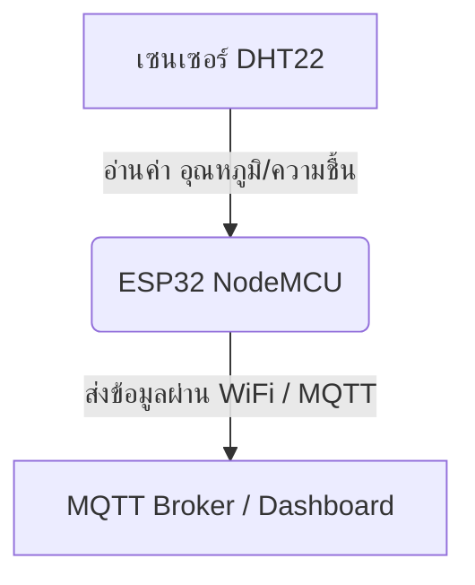

# 📟 คู่มือการใช้งานบอร์ด ESP32

บทความนี้รวมข้อมูลพินไดอะแกรม การต่อวงจร และโค้ดตัวอย่างการใช้งาน ESP32

---

## 📌 พินไดอะแกรม (Pinout)


---

## 💡 กล่องแจ้งเตือน & ข้อควรระวัง

!!! note "ข้อมูลพิน"
    แรงดันไฟขาออกของ GPIO คือ 3.3V ไม่รองรับแรงดัน 5V โดยตรง

!!! warning "ข้อควรระวังเรื่องพลังงาน"
    ห้ามจ่ายไฟ 5V เข้าช่อง 3V3 เพราะอาจทำให้ชิปเสียหายได้ทันที

---

## 📊 ผังการทำงาน (Mermaid Diagram)



---

## 💻 ตัวอย่างโค้ด (สลับภาษาด้วยแท็บ)

=== "Arduino IDE (C++)"
    ```cpp
    void setup() {
      Serial.begin(115200);
      pinMode(2, OUTPUT);
    }

    void loop() {
      digitalWrite(2, HIGH);
      delay(1000);
      digitalWrite(2, LOW);
      delay(1000);
    }
    ```

=== "MicroPython"
    ```python
    import machine
    import time

    led = machine.Pin(2, machine.Pin.OUT)

    while True:
        led.value(1)
        time.sleep(1)
        led.value(0)
        time.sleep(1)
    ```